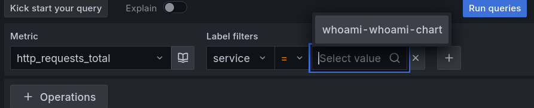
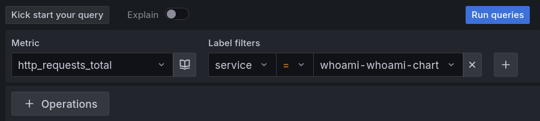

# Задание 2. Prometheus Exporter для ваших приложений

## Введение

Рассказать о том что мы уже развернули Prometheus stack теперь необходимо понять, как подключить к нему приложение, чтобы передавать метрики.

## Основная часть

Рассказать какие есть CRD (ServiceMonitor, PodMonitor) prometheus для того чтобы снимать метрики с приложения. На примере приложения <https://github.com/bee42/whoamI> дописать helm чарт для деплоя приложения с дополнительными ресурсами, в котором будет указан serviceMonitorSelector и ServiceMonitor. Чтобы были доступны метрики. Рассказать где брать prode selector (kubectl get prometheus -n monitoring kube-prometheus-stack-prometheus -o json | jq .spec.probeSelector)

### Сбор метрик приложения в Grafana

Проверка получения метрик

<div align="center"></div>

Создание дашборда


Новый дашборда


Создание нового дашборда


Выбор ресурса откуда брать данные для дашборжа


Выбор Prometheus ресурса


Окно создания


Выбор данных с помошью promql


Выбор поля приложения


Выбор имя приложения



Проверка запроса



## Заключение

Написать что у нас prometheus  использует CRD ServiceMonitor, который применяется для того чтобы передавать метрики для сбора.

## Данные

helm install

```bash
[mda@learning rebrain_test]$ helm upgrade --install whoami ./whoami-chart -n default
Release "whoami" does not exist. Installing it now.
W1005 14:10:26.827081   56114 warnings.go:70] unknown field "spec.selector.service"
NAME: whoami
LAST DEPLOYED: Sun Oct  5 14:10:26 2025
NAMESPACE: default
STATUS: deployed
REVISION: 1
NOTES:
1. Get the application URL by running these commands:
  export POD_NAME=$(kubectl get pods --namespace default -l "app.kubernetes.io/name=whoami-chart,app.kubernetes.io/instance=whoami" -o jsonpath="{.items[0].metadata.name}")
  export CONTAINER_PORT=$(kubectl get pod --namespace default $POD_NAME -o jsonpath="{.spec.containers[0].ports[0].containerPort}")
  echo "Visit http://127.0.0.1:8080 to use your application"
  kubectl --namespace default port-forward $POD_NAME 8080:$CONTAINER_PORT
```

service

```bash
[mda@learning rebrain_test]$ kubectl describe service whoami-whoami-chart 
Name:                     whoami-whoami-chart
Namespace:                default
Labels:                   app.kubernetes.io/instance=whoami
                          app.kubernetes.io/managed-by=Helm
                          app.kubernetes.io/name=whoami-chart
                          app.kubernetes.io/version=1.16.0
                          helm.sh/chart=whoami-chart-0.1.0
                          service=whoami
Annotations:              meta.helm.sh/release-name: whoami
                          meta.helm.sh/release-namespace: default
Selector:                 app.kubernetes.io/instance=whoami,app.kubernetes.io/name=whoami-chart
Type:                     ClusterIP
IP Family Policy:         SingleStack
IP Families:              IPv4
IP:                       10.96.231.28
IPs:                      10.96.231.28
Port:                     http  8080/TCP
TargetPort:               80/TCP
Endpoints:                10.112.128.15:80,10.112.129.10:80
Session Affinity:         None
Internal Traffic Policy:  Cluster
Events:                   <none>
```

servicemonitor

```bash
[mda@learning rebrain_test]$ kubectl describe servicemonitors.monitoring.coreos.com whoami-whoami-chart 
Name:         whoami-whoami-chart
Namespace:    default
Labels:       app.kubernetes.io/managed-by=Helm
              release=kube-prometheus-stack
Annotations:  meta.helm.sh/release-name: whoami
              meta.helm.sh/release-namespace: default
API Version:  monitoring.coreos.com/v1
Kind:         ServiceMonitor
Metadata:
  Creation Timestamp:  2025-10-05T10:13:35Z
  Generation:          1
  Resource Version:    22955
  UID:                 28326626-fb85-48f1-b57b-55f4bf0d7dee
Spec:
  Endpoints:
    Interval:  30s
    Path:      /metrics
    Port:      http
  Selector:
Events:  <none>
```

Метрики из приложения

```text
# HELP http_requests_total Total number of HTTP requests made.
# TYPE http_requests_total counter
http_requests_total{code="200",handler="whoamI",method="get"} 47.0
http_requests_total{code="200",handler="whoamI",method="head"} 765.0
```

debug prom

```bash
[mda@learning rebrain_test]$ kubectl port-forward service/kube-prometheus-stack-prometheus 9090:9090 -n monitoring
Forwarding from 127.0.0.1:9090 -> 9090
Forwarding from [::1]:9090 -> 9090
```

dubug app

```bash
[mda@learning rebrain_test]$ kubectl port-forward service/whoami-whoami-chart 8080:8080
Forwarding from 127.0.0.1:8080 -> 80
Forwarding from [::1]:8080 -> 80
```
