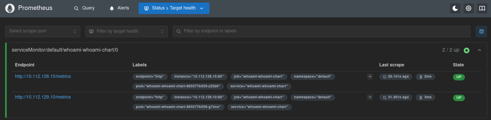
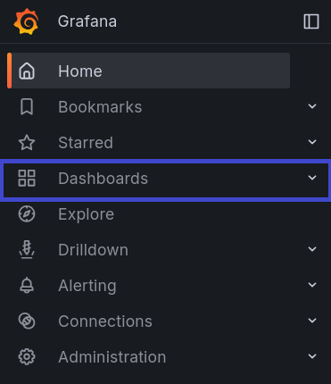
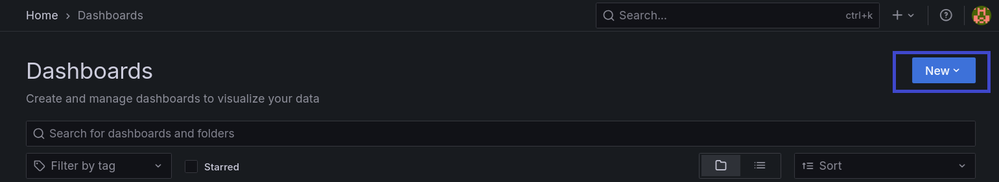
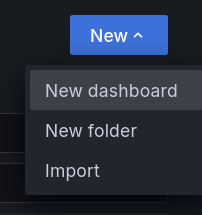
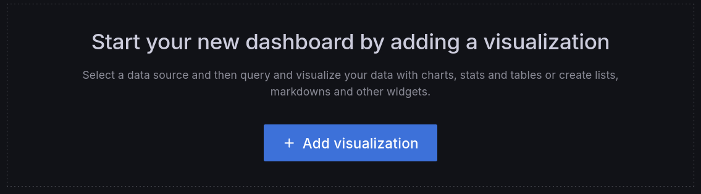
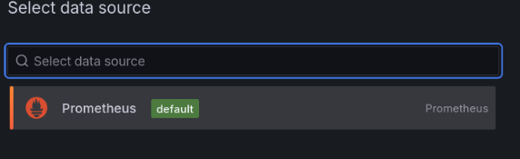
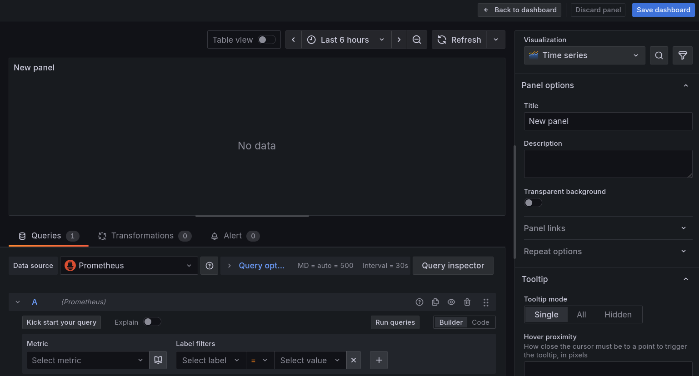
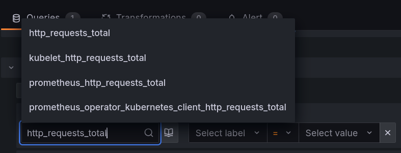
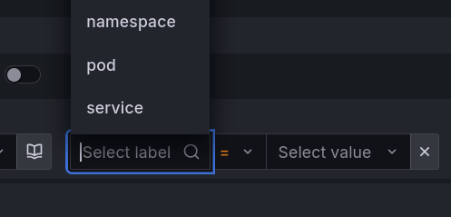

# Задание 2. Prometheus stack. Сбор метрик в Prometheus для ваших приложений

## Введение

На прошлом занятии вы уже развернули в кластере kubernetes (Prometheus Stack). Этот стек включает в себя Prometheus, Grafana, Alertmanager и, что самое важное, [Prometheus Operator](https://prometheus-operator.dev/docs/getting-started/introduction/). Prometheus Operator — это набор специальных ресурсов - Custom Resource Definitions (CRD) и контроллеров, которые автоматизируют развертывание и управление стеком мониторинга Prometheus в кластерах Kubernetes. Он упрощает настройку Prometheus, Alertmanager и других компонентов, позволяя инженерам использовать свои собственные объекты Kubernetes для управления конфигурациями, вместо ручного редактирования текстовых файлов. На этом уроке наша задача, используя Prometheus Operator — настроить мониторинг для приложения, с помощью Prometheus Stack.

## Основная часть

### Основные CRD Prometheus Operator

[Prometheus Operator](http://prometheus-operator.dev/docs/api-reference/api/) предоставляет множество CRD. В данном уроке нас интересуют два основных CRD для сбора метрик из приложений:

#### ServiceMonitor

ServiceMonitor используется для мониторинга группы pod`ов через Kubernetes services. Это наиболее распространенный и часто рекомендуемый способ. ServiceMonitor с помощью поля **selector** находит Service в кластере. Затем Prometheus сканирует pod'ы, на которые указывает этот service, по эндпоинтам, указанным в секции endpoints servicemonitor'а.

Пример манифеста ServiceMonitor для Prometheus Operator.

```yaml
apiVersion: monitoring.coreos.com/v1
kind: ServiceMonitor
metadata:
  name: my-app
  labels:
    release: prometheus  # Метка для Prometheus Operator, который будет управлять этим ServiceMonitor
spec:
  selector:
    matchLabels:
      app: my-application # Выбираем service с меткой app=my-application
  namespaceSelector:
    matchNames:
      - default # В каком пространстве имен искать сервисы
  endpoints:
  - port: http # Имя порта из объекта service
    path: /metrics # Путь для сбора метрик
    interval: 30s # Как часто собирать метрики
    scrapeTimeout: 10s # Таймаут на получение метрик
```

**Важно понимать!** При развертывание через kube-prometheus-stack, Prometheus по умолчанию не видит `servicemonitor`. Это связано с тем, что используется [serviceMonitorSelector](https://github.com/prometheus-community/helm-charts/blob/main/charts/kube-prometheus-stack/values.yaml#L4138C65-L4138C88). ServiceMonitorSelector в ServiceMonitor — это селектор, определяющий, какие метрики будут собираться для каких сервисов в Kubernetes, который используется Prometheus Operator. Он указывает Prometheus, какие Service-объекты в кластере Kubernetes нужно сканировать для поиска целей сбора метрик, основываясь на метках (labels) этих сервисов.

Для того, чтобы настроить связь ServiceMonitor'ов и Prometheus необходимо указать serviceMonitorSelector. Чуть позже я покажу как его [найти](https://github.com/Kulichanin/task_2/blob/main/%D0%97%D0%B0%D0%B4%D0%B0%D0%BD%D0%B8%D0%B5%202.%20Prometheus%20Exporter%20%D0%B4%D0%BB%D1%8F%20%D0%B2%D0%B0%D1%88%D0%B8%D1%85%20%D0%BF%D1%80%D0%B8%D0%BB%D0%BE%D0%B6%D0%B5%D0%BD%D0%B8%D0%B9.md#%D0%BF%D0%BE%D0%B8%D1%81%D0%BA-servicemonitorselector).

#### PodMonitor

PodMonitor используется для мониторинга группы pods напрямую, без необходимости создания service. PodMonitor с помощью selector находит pod'ы напрямую и сканирует их по эндпоинтам, указанным в секции podMetricsEndpoints.

Такой метод метрик используется реже. Обычно такой способ используют, когда создание service нецелесообразно или требуется более гибкое управление целями для сканирования.

Для большинства случаев используется ServiceMonitor, особенно для мониторинга стандартных сервисов, поэтому в практическом примере будет рассмотрен он. Для полноты картины пример манифеста PodMonitor.

```yaml
apiVersion: monitoring.coreos.com/v1
kind: PodMonitor
metadata:
  name: my-app
  labels:
    release: prometheus # Пример метки для Prometheus Operator
spec:
  selector:
    matchLabels:
      app: my-app # Селектор подов, которые мы хотим мониторить
  podMetricsEndpoints:
  - port: metrics # Имя порта из спецификации пода (в <Pod> Definition)
    path: /metrics # Путь к эндпоинту метрик (например, для Prometheus)
    interval: 30s # Как часто собирать метрики (опционально)
    relabelings: # Опционально: переписывание меток перед отправкой в Prometheus
    - sourceLabels: [__meta_kubernetes_pod_node_name]
      targetLabel: node
```

### Пример создания ServiceMonitor для приложения

На прошлом занятии мы для примера работы c helm chart использовали приложение [whoami](https://github.com/bee42/whoamI/tree/2.2.0). Данное приложение уже умеет отдавать метрики в формате prometheus на эндпоинте /metrics. Продолжим использовать его и добавим в наш helm chart ServiceMonitor и затем настроим сбор и просмотр метрик в Grafana через Prometheus.

В случае, если в приложение не реализован механизм сбора метрик в формате метрик Prometheus, [вот тут](https://prometheus.io/docs/instrumenting/clientlibs/) в документации указаны библиотеки для популярных языков программирования.

Дополним Helm-чарт приложения whoami, чтобы при деплое создавались необходимые ресурсы для его мониторинга.

#### Доработка helm chart для сбора метрик

Первым делом нужно убедиться, что в шаблоне service корректно создаются labels.

```yaml
# whoami-chart/templates/service.yaml
apiVersion: v1
kind: Service
metadata:
  name: {{ include "whoami-chart.fullname" . }}
  labels:
    {{- include "whoami-chart.labels" . | nindent 4 }} # Эти метки будет использоваться ServiceMonitor для поиска service
    service: whoami
spec:
  type: {{ .Values.service.type }}
  ports:
    - port: {{ .Values.service.port }}
      targetPort: {{ .Values.service.targetPort }}
      protocol: TCP
      name: {{ .Values.service.name }}
  selector:
      {{- include "whoami-chart.selectorLabels" . | nindent 4 }}
```

Теперь создадим файл `templates/servicemonitor.yaml`. Данные шаблон создает манифест для ServiceMonitor.

```yaml
# whoami-chart/templates/servicemonitor.yaml
{{- if .Values.serviceMonitor.enabled }}
apiVersion: monitoring.coreos.com/v1
kind: ServiceMonitor
metadata:
  name: {{ include "whoami-chart.fullname" . }}
  namespace: {{ .Release.Namespace }}
  labels:
  {{- include "whoami-chart.labels" . | nindent 4 }}
  # Критически важная метка: должна совпадать с serviceMonitorSelector Prometheus
  {{- with .Values.serviceMonitor.additionalLabels }}
  {{- toYaml . | nindent 4 }}
  {{- end }}
spec:
  selector:
    matchLabels:
      # Эти метки должны совпадать с метками в service.metadata.labels
      app.kubernetes.io/name: {{ include "whoami-chart.name" . }}
      app.kubernetes.io/instance: {{ .Release.Name }}
      service: whoami
  endpoints:
    # Должен совпадать с service.spec.ports[*]
    - port: {{ .Values.service.name }}
      interval: {{ .Values.serviceMonitor.interval }}
      path: {{ .Values.serviceMonitor.path }}
  # Ищем Service в namespace, где установлен whoami
  namespaceSelector:
    matchNames:
      - {{ .Release.Namespace }}
{{- end }}
```

ServiceMonitor должен находиться в том же namespace, что и Prometheus (например, monitoring), или должен быть настроен соответствующий namespaceSelector в конфигурации Prometheus.

##### Поиск serviceMonitorSelector

Поиск serviceMonitorSelector, который определяет, какие метрики будут собираться для каких сервисов в Kubernetes, получаем следующей командой.

```bash
kubectl get prometheus -n monitoring kube-prometheus-stack-prometheus -o json | jq .spec.probeSelector
```

Данная команда работает в случае, если вы установили **prometheus** с помощью **kube-prometheus-stack** в namespace **monitoring**. Скорректируйте команду согласно вышим настройкам prometheus.

Добавим в конец файла `whoami-chart/values.yaml` настройки для servicemonitor, чтобы helm сгенерировал из шаблона корректный манифест.

```yaml
# whoami-chart/values.yaml
serviceMonitor:
  enabled: true
  # Интервал сбора метрик
  interval: "10s"
  path: "/metrics"
  # Дополнительные метки для селектора Prometheus
  additionalLabels:
    release: kube-prometheus-stack
```

Проверим в **whoami-chart**, что новый helm template работает корректно.

```bash
helm template -s templates/servicemonitor.yaml .
```

Корректный вывод servicemonitor

```yaml
---
# Source: whoami-chart/templates/servicemonitor.yaml
apiVersion: monitoring.coreos.com/v1
kind: ServiceMonitor
metadata:
  name: release-name-whoami-chart
  namespace: default
  labels:
    helm.sh/chart: whoami-chart-0.1.0
    app.kubernetes.io/name: whoami-chart
    app.kubernetes.io/instance: release-name
    app.kubernetes.io/version: "1.16.0"
    app.kubernetes.io/managed-by: Helm
    release: kube-prometheus-stack
spec:
  selector:
    matchLabels:
      # Эти метки должны совпадать с метками в service.metadata.labels.
      app.kubernetes.io/name: whoami-chart
      app.kubernetes.io/instance: release-name
      service: whoami
  endpoints:
    # Должен совпадать с service.spec.ports[*].name
    - port: http
      interval: 10s
      path: /metrics
  # В каком пространстве имен искать сервис
  namespaceSelector:
    matchNames:
      - default
```

Теперь все готово для деплоя приложения. Запустим и проверим работоспособность.

```bash
[mda@learning rebrain]$ helm upgrade --install whoami ./whoami-chart -n default
Release "whoami" does not exist. Installing it now.
NAME: whoami
LAST DEPLOYED: Sun Oct  5 14:10:26 2025
NAMESPACE: default
STATUS: deployed
REVISION: 1
NOTES:
1. Get the application URL by running these commands:
  export POD_NAME=$(kubectl get pods --namespace default -l "app.kubernetes.io/name=whoami-chart,app.kubernetes.io/instance=whoami" -o jsonpath="{.items[0].metadata.name}")
  export CONTAINER_PORT=$(kubectl get pod --namespace default $POD_NAME -o jsonpath="{.spec.containers[0].ports[0].containerPort}")
  echo "Visit http://127.0.0.1:8080 to use your application"
  kubectl --namespace default port-forward $POD_NAME 8080:$CONTAINER_PORT
```

#### Сбор метрик приложения и создание dashboard в Grafana

После успешного деплоя, откроем интерфейс Prometheus, перейдем в Status > Targets и проверим, что метрики приложения появляются. Как правило, метрики появляются через какое-то время. Поэтому лучше подождать пару минут, после того как была создана роль.

В нашем случае, с приложением whoami метрики выглядят, как показано ниже.

<p align="center">
  
</p>

Тут можно увидеть, количество реплик приложения, состояние, эндпоинты и метки приложения.

Теперь зайдем в Grafana и создадим dashboard для сбора метрик приложения. Whoami на эндпоинте /metrics отдает большое количество метрик. На уроке мы рассмотрим на графики метрики **http_requests_total**. Для тестов, чтобы метрика изменялась и количество запросов росло, используем следующий скрипт и **kubectl port-forward** для того, чтобы обратиться на прямую к приложению. В проде цифры будут значительно больше и появятся сразу.

Проброс порта приложения для проверки.

```bash
[mda@learning rebrain]$ kubectl port-forward service/whoami-whoami-chart 8080:8080
Forwarding from 127.0.0.1:8080 -> 80
Forwarding from [::1]:8080 -> 80
```

Скрипт для создания тестовых обращений

```bash
#!/bin/bash
URL="http://127.0.0.1:8080/" # Замените на URL вашего приложения

while true; do
  curl -I "$URL"
  sleep 1
done    
```

Показатели после некоторого времени работы скрипта. Как видно, они стали расти.

```bash
# HELP http_requests_total Total number of HTTP requests made.
# TYPE http_requests_total counter
http_requests_total{code="200",handler="whoamI",method="get"} 47.0
http_requests_total{code="200",handler="whoamI",method="head"} 765.0
```

Далее перейдем в Grafana для создания dashboard. После авторизации, в панели слева зайдем в Dashboards (Отмечено синим).

<p align="center">
  
</p>

Откроется меню с доступными dashboard. Выберем справа из выпадающего меню **New** создание нового dashboard.

<p align="center">
  
</p>

Нужно поле New Dashboard.

<p align="center">
  
</p>

Grafana предложит нам выбрать ресурс откуда брать данные. Смело кликаем на **Add visualization**.

<p align="center">
  
</p>

Выберем на Prometheus из доступных ресурсов.

<p align="center">
  
</p>

После этого откроется редактор для создания dashboard.

<p align="center">
  
</p>

Для начала нас интересует панель внизу, в которую мы будем вводить данные для выборки.

Заполним данными, о которых говорили выше. Используем метрику **http_requests_total**, выберем по какой метке искать приложение **whoami** и имя нашего приложения.

<p align="center">
  
</p>

Получим данные с помощью кнопки `Run queries`. Если все верно настроено, мы увидим графики запросов.

<p align="center">
  
</p>

В окне справа `Visualization` есть множество косметических настроек. Также не забудем сохранить наш новый dashboard - `Save dashboard`.

## Заключение

В результате урока мы настроили автоматическое обнаружение метрик нашего приложения whoami в Prometheus. Для этого мы используем CRD servicemonitor, который декларативно описывает, какие сервисы и как должен сканировать Prometheus. Нужно помнить о том, что servicemonitor выбирает нужный service по меткам (selector), а Prometheus, в свою очередь, выбирает servicemonitor'ы также по меткам (serviceMonitorSelector).

После применения обновленного helm-чарта и создания servicemonitor, Prometheus Operator автоматически обновит конфигурацию Prometheus, и твои метрики появятся в целях (targets) Prometheus, обычно в течение пары минут. После с этими метриками можно взаимодействовать в Grafana для создания своих dashboard.

В случае если что-то пошло не так, используй следующий алгоритм для выявления проблем:

Проверить цель в Prometheus:

  1. Открыть интерфейс Prometheus.
  2. Перейте в Status > Targets.
  3. Найди цель с именем твоего ServiceMonitor.

Если цель отображается и имеет статус UP, но в Grafana ничего нет:

  1. Возможно метрики еще не начали поступать и необхожимо подождать.
  2. Посмотреть через **kubectl port-forward** точно ли идут какие-то метрики. Иногда бывает проблема со стороны приложения, что метрики считаются некоррректно.
  
Если цель не отображается или имеет статус DOWN:

  1. Проверь метки через **kubectl describe**: Убедись, что метки на servicemonitor совпадают с селектором Prometheus, а метки на service совпадают с селектором servicemonitor.
  2. Проверь **namespace**: Убедись, что namespaceSelector в servicemonitor включает неймспейс твоего приложения, и что servicemonitor находится в неймспейсе, который видит Prometheus (часто monitoring).
  3. Проверь эндпоинт вручную: Используй **kubectl port-forward** на pod приложения и проверь, доступны ли метрики по пути /metrics на нужном порту.

Для более глубокого выявления проблем воспользуйся документацией по [prometheus-operator](https://prometheus-operator.dev/docs/platform/troubleshooting/)

## Практическое задание

1. Изменить helm chart [приложения](https://github.com/brancz/prometheus-example-app) из задания 2 для запуска приложения с получением метрик от Promethues Exporter приложения.
2. Убедиться, что метрики успешно передаются в Promethues.
3. Создать в графана dashboard для сбора метрик http_requests_total.
4. Сгенерировать данные удобным вам способом.
5. Убедиться, что графики строяться согласно данным.
6. Отправить задание на проверку.
