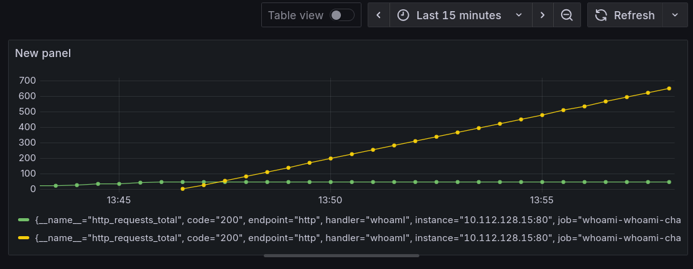

# Задание 2. Prometheus Exporter для ваших приложений

## Введение

На прошлом занятие мы уже развернули в кластере Kubernetes Prometheus Stack (По отдельнотси, а также через kube-prometheus-stack). Этот стек включает в себя Prometheus, Grafana, Alertmanager и, что самое важное, Prometheus Operator. Prometheus Operator упрощает управление мониторингом, вводя специальные Custom Resource Definitions (CRD). Теперь наша задача — настроить мониторинг для нашего приложения, чтобы его метрики собирались этим стеком. В на этом уроке ты узнаешь, как это сделать.

## Основная часть

### Основные CRD Prometheus Operator

[Prometheus Operator](https://github.com/prometheus-operator/prometheus-operator?tab=readme-ov-file#customresourcedefinitions) предоставляет два основных CRD для настройки сбора метрик с приложений:

#### ServiceMonitor

ServiceMonitor используется для мониторинга группы Pod`ов через Kubernetes Services. Это наиболее распространенный и часто рекомендуемый способ. ServiceMonitor с помощью поля *selector* находит Service в кластере. Затем Prometheus сканирует Pod'ы, на которые указывает этот Service, по эндпоинтам, указанным в секции endpoints ServiceMonitor'а. Пример создания такой роли.

*Важно понимать!* Prometheus по умолчанию не видет ServiceMonitor`ы. Для того чтобы настройть связь ServiceMonitor'ов и Prometheus необходимо использовать serviceMonitorSelector. Чуть позже я покажу как его найти.

Пример манифеста ServiceMonitor для Prometheus Operator.

```yaml
apiVersion: monitoring.coreos.com/v1
kind: ServiceMonitor
metadata:
  name: my-app
  labels:
    release: prometheus  # Метка для Prometheus Operator, который будет управлять этим ServiceMonitor
spec:
  selector:
    matchLabels:
      app: my-application # Выбираем service с меткой app=my-application
  namespaceSelector:
    matchNames:
      - default # В каком пространстве имен искать сервисы
  endpoints:
  - port: http # Имя порта из объекта service
    path: /metrics # Путь для сбора метрик
    interval: 30s # Как часто собирать метрики
    scrapeTimeout: 10s # Таймаут на получение метрик
```

#### PodMonitor

PodMonitor используется для мониторинга группы Kubernetes Pods напрямую, без необходимости создания Service. PodMonitor с помощью селектора selector находит Pod'ы напрямую и сканирует их по эндпоинтам, указанным в секции podMetricsEndpoints.

Такой метод метрик используется реже. Обычно такое способ используют, когда создание Service нецелесообразно или требуется более гибкое управление целями для сканирования.

Для большинства случаев используется ServiceMonitor, особенно для мониторинга стандартных сервисов, поэтому в прктическом примере будет рассмотрен он. Для полноты картины пример манифеста ServiceMonitor для Prometheus Operator.

```yaml
apiVersion: monitoring.coreos.com/v1
kind: PodMonitor
metadata:
  name: my-app
  labels:
    release: prometheus # Пример метки для Prometheus Operator
spec:
  selector:
    matchLabels:
      app: my-app # Селектор подов, которые мы хотим мониторить
  podMetricsEndpoints:
  - port: metrics # Имя порта из спецификации пода (в <Pod> Definition)
    path: /metrics # Путь к эндпоинту метрик (например, для Prometheus)
    interval: 30s # Как часто собирать метрики (опционально)
    relabelings: # Опционально: переписывание меток перед отправкой в Prometheus
    - sourceLabels: [__meta_kubernetes_pod_node_name]
      targetLabel: node
```

### Пример создания ServiceMonitor для приложения

На прошлом занятии мы для примера создания c helm chart использовали приложение [whoami](https://github.com/bee42/whoamI/tree/2.2.0). Данное приложение уже умеет отдавать метрики в формате Prometheus на эндпоинте /metrics. Продолжим использовать его и добавим в наш helm chart ServiceMonitor и затем настроим сбор и просмотр метрик в Grafana через Prometheus.

Написание метрик для приложения выходит за рамки данного курса. Если вы столкнулись с тем, что приложение уже есть, а метрики для нет, то [вот тут](https://prometheus.io/docs/instrumenting/clientlibs/) в официальной докуменатации указаны библиотеки для популярных языков программирования.

Дополним Helm-чарт этого приложения, чтобы при деплое автоматически создавались необходимые ресурсы для его мониторинга.

#### Доработка helm chart для сбора метрик

Первым делом нужно убедиться что в шаблоне Service корректно создаются labels.

```yaml
# whoami-chart/templates/service.yaml
apiVersion: v1
kind: Service
metadata:
  name: {{ include "whoami-chart.fullname" . }}
  labels:
    {{- include "whoami-chart.labels" . | nindent 4 }} # Эти метки будет использоваться ServiceMonitor для поиска service
    service: whoami
spec:
  type: {{ .Values.service.type }}
  ports:
    - port: {{ .Values.service.port }}
      targetPort: {{ .Values.service.targetPort }}
      protocol: TCP
      name: {{ .Values.service.name }}
  selector:
      {{- include "whoami-chart.selectorLabels" . | nindent 4 }}
```

Теперь создадим файл templates/servicemonitor.yaml. ServiceMonitor должен находиться в том же namespace, что и Prometheus (например, monitoring), или должен быть настроен соответствующий namespaceSelector в конфигурации Prometheus.

```yaml
# whoami-chart/templates/servicemonitor.yaml
{{- if .Values.serviceMonitor.enabled }}
apiVersion: monitoring.coreos.com/v1
kind: ServiceMonitor
metadata:
  name: {{ include "whoami-chart.fullname" . }}
  namespace: {{ .Release.Namespace }}
  labels:
  {{- include "whoami-chart.labels" . | nindent 4 }}
  # !Критически важная метка: должна совпадать с serviceMonitorSelector Prometheus
  {{- with .Values.serviceMonitor.additionalLabels }}
  {{- toYaml . | nindent 4 }}
  {{- end }}
spec:
  selector:
    matchLabels:
      # !Эти метки должны совпадать с метками в service.metadata.labels
      app.kubernetes.io/name: {{ include "whoami-chart.name" . }}
      app.kubernetes.io/instance: {{ .Release.Name }}
      service: whoami
  endpoints:
    # !Должен совпадать с service.spec.ports[*]
    - port: {{ .Values.service.name }}
      interval: {{ .Values.serviceMonitor.interval }}
      path: {{ .Values.serviceMonitor.path }}
  # Ищем Service в namespace, где установлен whoami
  namespaceSelector:
    matchNames:
      - {{ .Release.Namespace }}
{{- end }}
```

Как было написано выше Prometheus Resource, управляемый Prometheus Operator, использует поле serviceMonitorSelector, чтобы решить, какие ServiceMonitor'ы использовать.

Данная команда вернуть поле probeSelector.

```bash
kubectl get prometheus -n monitoring kube-prometheus-stack-prometheus -o json | jq .spec.probeSelector
```

Важно понимать, что данная команда работает в случае, если вы установили **prometheus** с помощью kube-prometheus-stack в namespace **monitoring**. Поправте команду согласно вышим данным.

Теперь мы можем скорректировать `whoami-chart/values.yaml`. Необходимо добавить данные для ServiceMonitor в конец файла.

```yaml
# whoami-chart/values.yaml
serviceMonitor:
  enabled: true
  # Интервал сбора метрик
  interval: "10s"
  path: "/metrics"
  # !Дополнительные метки для селектора Prometheus
  additionalLabels:
    release: kube-prometheus-stack
```

Проверим в **whoami-chart**, что новый helm template работает корректно.

```bash
helm template -s templates/servicemonitor.yaml .
```

Корректный вывод

```yaml
---
# Source: whoami-chart/templates/servicemonitor.yaml
apiVersion: monitoring.coreos.com/v1
kind: ServiceMonitor
metadata:
  name: release-name-whoami-chart
  namespace: default
  labels:
    helm.sh/chart: whoami-chart-0.1.0
    app.kubernetes.io/name: whoami-chart
    app.kubernetes.io/instance: release-name
    app.kubernetes.io/version: "1.16.0"
    app.kubernetes.io/managed-by: Helm
    release: kube-prometheus-stack
spec:
  selector:
    matchLabels:
      # !Эти метки должны совпадать с метками в service.metadata.labels.
      app.kubernetes.io/name: whoami-chart
      app.kubernetes.io/instance: release-name
      service: whoami
  endpoints:
    # !Должен совпадать с service.spec.ports[*].name
    - port: http
      interval: 10s
      path: /metrics
  # В каком пространстве имен искать сервисы
  namespaceSelector:
    matchNames:
      - default
```

Теперь все готово для деплоя приложения. Запустим и проверим работособность.

```bash
[mda@learning rebrain]$ helm upgrade --install whoami ./whoami-chart -n default
Release "whoami" does not exist. Installing it now.
NAME: whoami
LAST DEPLOYED: Sun Oct  5 14:10:26 2025
NAMESPACE: default
STATUS: deployed
REVISION: 1
NOTES:
1. Get the application URL by running these commands:
  export POD_NAME=$(kubectl get pods --namespace default -l "app.kubernetes.io/name=whoami-chart,app.kubernetes.io/instance=whoami" -o jsonpath="{.items[0].metadata.name}")
  export CONTAINER_PORT=$(kubectl get pod --namespace default $POD_NAME -o jsonpath="{.spec.containers[0].ports[0].containerPort}")
  echo "Visit http://127.0.0.1:8080 to use your application"
  kubectl --namespace default port-forward $POD_NAME 8080:$CONTAINER_PORT
```

#### Сбор метрик приложения и создание dashboard в Grafana

После успешного деплоя, откроем интерфейс Prometheus, перейдем в Status > Targets и проверим что метрики приложения появляются. Как правило метрики появляются через какое-то время. Поэтому лучше подождать 5 минут, после того как была созда роль.

В нашем случае, с приложением whoami метрики выгледят, как показано, на скриншоте ниже

<p align="center">
  
</p>

Тут можно увидеть, количество реплик приложения, состояние, эндпоинты и метки приложения.

Теперь зайдем в Grafana и создадим dashboard для сбора метрик приложения whoami на эндпоинте /metrics отдает большое количество метрик. На уроке мы посмотрим на графики метрики **http_requests_total**. Для тестов, чтобы количество запросов росло и они постепенно приходили к нам и были данные для урока, я использовал следующий скрипт и **kubectl port-forward** для того, чтобы обратиться на прямую к приложению. В продакшане цифры будут значительно больше и появятся сразу).

Проброс порта приложения для проверки.

```bash
[mda@learning rebrain]$ kubectl port-forward service/whoami-whoami-chart 8080:8080
Forwarding from 127.0.0.1:8080 -> 80
Forwarding from [::1]:8080 -> 80
```

Скрипт для создания тестовых обращений

```bash
#!/bin/bash
URL="http://127.0.0.1:8080/" # Замените на URL вашего приложения

while true; do
  curl -I "$URL"
  sleep 1
done    
```

Показатели после некоторого времени работы скрипта. Как видно, они стали рости.

```bash
# HELP http_requests_total Total number of HTTP requests made.
# TYPE http_requests_total counter
http_requests_total{code="200",handler="whoamI",method="get"} 47.0
http_requests_total{code="200",handler="whoamI",method="head"} 765.0
```

Из документации к приложению по http_requests_total

После авторизации в Grafana, в панели слева зайдем в dashboard(Отмечано синим).

<p align="center">
  
</p>

Откроется меню с доступными dashboard. Выберем слева из выподающего меню **New** создание нового dashboard.

<p align="center">
  
</p>

Нужно поле New Dashboard.

<p align="center">
  
</p>

Grafana предложить нам выбрать ресурс откуда брать данные. Смело кликаем на **Add visualization**.

<p align="center">
  
</p>

Выберем на Prometheus из доступных ресурсов.

<p align="center">
  
</p>

После этого откроется редактор для создания dashboard.

<p align="center">
  
</p>

Для начала нас интересуется панель внизу в которую мы будем вводить данные для выборки.

Запоним данными, о которых говорили выше. Используем меьтрику **http_requests_total**, выберем по какой метки искать приложение **whoami** и имя нашего приложения.

<p align="center">
  
</p>

Если все верно настроено, мы увидим графики запросов.

<p align="center">
  
</p>

В окне справа есть множество космитеских настроек, также не забудем сохранить наш новый dashboard.

## Заключение

В результате урока мы настроили автоматическое обнаружение метрик нашего приложения whoami в Prometheus. Для этого мы используем CRD ServiceMonitor, который декларативно описывает, какие сервисы и как должен сканировать Prometheus. Нужно помнить о том, что ServiceMonitor выбирает нужный Service по меткам (selector), а Prometheus, в свою очередь, выбирает ServiceMonitor'ы также по меткам (serviceMonitorSelector).

После применения обновленного Helm-чарта и создания ServiceMonitor, Prometheus Operator автоматически обновит конфигурацию Prometheus, и твои метрики появятся в целях (Targets) Prometheus, обычно в течение пары минут.
После с этими метриками можно взаимодействовать в Grafana для создания своих dashboard.

В случае если что-то пошло не так, используй слудющий алгоритм для выявления проблем:

1. Проверь цель в Prometheus:
    * Открой интерфейс Prometheus.
    * Перейди в Status > Targets.
    * Найди цель с именем твоего ServiceMonitor. Ее статус должен быть UP.
2. Если цель не отображается или имеет статус DOWN:
    * Проверь метки: Убедись, что метки на ServiceMonitor совпадают с селектором Prometheus, а метки на Service совпадают с селектором ServiceMonitor.
    * Проверь namespace: Убедись, что namespaceSelector в ServiceMonitor включает неймспейс твоего приложения, и что ServiceMonitor находится в неймспейсе, который видит Prometheus (часто monitoring).
    * Проверь эндпоинт вручную: Используй **kubectl port-forward** на Pod приложения и проверь, доступны ли метрики по пути /metrics на нужном порту.
    * Проверь логи Prometheus Operator: В них может быть информация об ошибках при применении конфигурации.

## Практическое задание

1. Изменить helm chart [приложения](https://github.com/brancz/prometheus-example-app) из задания 2 для запуска приложения с получением метрик от Promethues Exporter приложения.
2. Понять какая метка для передачи, чтобы prometheus заметил приложение.
3. Убедиться, что метрики успешно передаются в Promethues.
4. Отправить задание на проверку.
